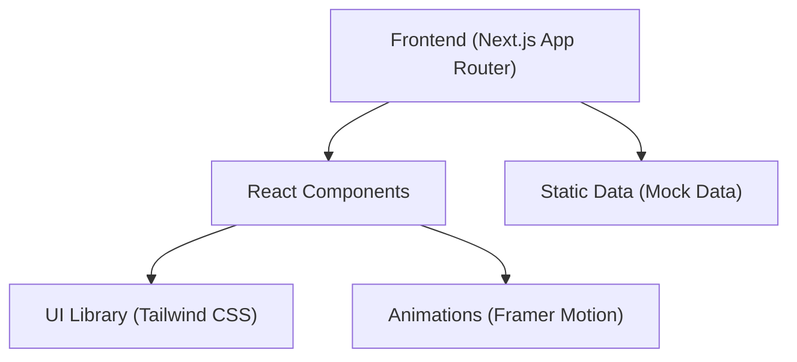

## 1. 架构设计


## 2. 技术栈描述
- **核心框架**: Next.js (App Router, React 18)
- **开发语言**: TypeScript
- **样式方案**: Tailwind CSS (利用其 Utility-first 特性实现极简高级风格)
- **动画库**: Framer Motion (用于页面级转场、卡片悬浮、滚动进入等效果)
- **图标库**: Lucide React (极简线条图标，符合整体设计语言)
- **构建工具**: 本项目将通过 `npx create-next-app@latest` 初始化

## 3. 路由定义
采用 Next.js App Router 的目录结构：
| 路由路径 | 页面说明 | 对应文件 |
|-------|---------|---------|
| `/` | Home 首页 | `app/page.tsx` |
| `/about` | About Me 页面 | `app/about/page.tsx` |
| `/projects` | Projects 页面 | `app/projects/page.tsx` |
| `/framework` | Evaluation Framework 页面 | `app/framework/page.tsx` |
| `/workflow` | AI Workflow 页面 | `app/workflow/page.tsx` |
| `/resume` | Resume 页面（含下载按钮） | `app/resume/page.tsx` |

## 4. 组件划分 (Components)
- `components/layout/Navbar.tsx`：顶部全局导航
- `components/layout/Footer.tsx`：底部信息栏
- `components/ui/Card.tsx`：通用卡片组件，封装 Hover 渐变与动画
- `components/ui/SectionHeading.tsx`：通用区块标题
- `components/ui/Badge.tsx`：标签组件（用于技能、项目分类等）
- `components/animations/FadeIn.tsx`：滚动渐入动画高阶组件

## 5. 数据模型设计 (静态数据)
目前采用本地静态 Mock 数据驱动页面渲染，后续方便替换或扩展。
```typescript
// types/index.ts

export interface Metric {
  value: string;
  label: string;
}

export interface Skill {
  category: string;
  items: string[];
}

export interface Project {
  id: string;
  title: string;
  subtitle: string;
  background: string;
  myWork: string[];
  framework?: any; // 用于树状结构展示
  badcase?: {
    prompt: string;
    issues: string[];
    attribution: string[];
  };
  process?: string[]; // 流程展示
  capabilities?: string[];
}
```
