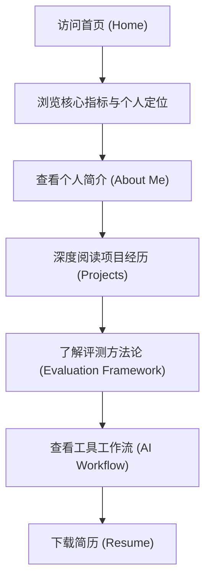

## 1. 产品概述
构建一个极简、高级、专业的个人 AI Portfolio 网站，用于展示作为 AI 训练师/AI 评测专家的项目经历与核心能力。
- **主要目标**：求职展示，突出大模型评测、多模态模型评估、数据生产流程建设等核心能力。
- **目标用户**：招聘方（HR、技术负责人、AI 团队 Leader）。
- **设计风格**：对标 OpenAI Research / Anthropic Engineer 风格，采用大面积留白、卡片式布局、黑白主色调搭配蓝紫渐变点缀，拒绝花哨和普通博客感。

## 2. 核心功能

### 2.1 功能模块
1. **Home 首页**：高级 Hero 区域，个人基本信息与核心指标卡片展示。
2. **About Me 页面**：个人简介与核心能力（技能矩阵卡片）。
3. **Projects 页面**：三个核心项目的深度展示（卡片式，含流程图、架构图、Badcase 分析模块）。
4. **Evaluation Framework 页面**：评测方法论展示，流程图及维度说明。
5. **AI Workflow 页面**：AI 工具链能力与优化前后工作流对比。
6. **Resume 页面**：提供简历 PDF 下载入口。

### 2.2 页面详细信息
| 页面名称 | 模块名称 | 功能描述 |
|-----------|-------------|---------------------|
| Home | Hero Section | 展示姓名、职位、中英双语简介、核心标签及数据指标卡片，带有优雅入场动画 |
| About Me | 简介与技能矩阵 | 文本简介，以及卡片形式展示的核心能力矩阵 |
| Projects | 项目卡片列表 | 详细展示三个核心项目的背景、工作内容、评测框架和可视化流程 |
| Evaluation Framework | 评测方法论 | 结构化展示评测流程、漏斗或步骤图，列举评测维度 |
| AI Workflow | 生产力工作流 | 对比传统流程与 AI 优化后流程，展示所用工具链 |
| Resume | 简历下载 | 简约的独立页面或模块，提供明确的下载交互 |

## 3. 核心流程
用户在网站内的主要浏览路径：

## 4. 用户界面设计

### 4.1 设计风格
- **主色调**：白色（背景）、黑色（主要文字）。
- **点缀色**：蓝紫渐变（Blue-Purple Gradient），用于强调核心元素或边框 hover 状态。
- **排版布局**：大面积留白（White Space），卡片式结构，严谨的对齐，极简高级的现代科技感。
- **字体**：现代无衬线字体（如 Inter, Geist 或系统自带高级无衬线体），标题具有视觉冲击力，正文清晰易读。
- **动画效果**：基于 Framer Motion，仅保留专业、克制的动画（页面渐入、卡片轻微上浮及边框发光、滚动渐入），禁止游戏化和过度炫技的 3D 效果。

### 4.2 页面设计概览
| 页面名称 | 模块名称 | UI 元素及样式 |
|-----------|-------------|-------------|
| 导航栏 | Navbar | 顶部固定，极简文字链接，当前页高亮，毛玻璃背景 |
| Home | Hero | 超大字号英文名，渐变副标题，3个药丸状核心标签，下方4个极简数据卡片（数字大字号） |
| About Me | 技能矩阵 | 卡片网格布局，微交互 hover 阴影，极简线条图标 |
| Projects | 项目详情 | 大卡片布局，内部包含代码块或树状文本展示（如框架、Badcase分析），采用单色/极简图表展现流程 |
| Evaluation Framework | 流程图 | 步骤卡片或连线图示，强调逻辑性与严谨性 |
| AI Workflow | 对比视图 | 左右或上下对比布局（传统 vs 优化），突出效率提升，极简工具标签 |

### 4.3 响应式要求
- 采用移动端优先 / 桌面端自适应（Desktop-first, mobile-adaptive）。
- 桌面端：多列网格布局，充足边距。
- 移动端：单列流式布局，优化触控卡片大小，导航栏收起为汉堡菜单。
